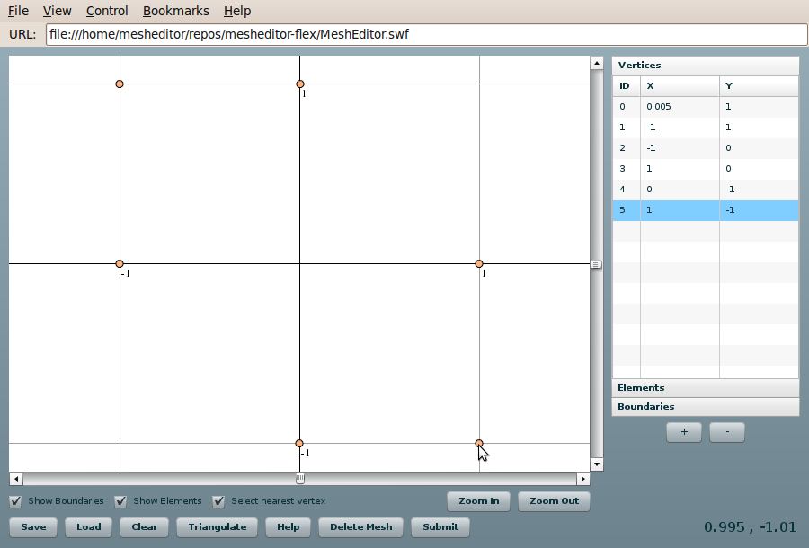
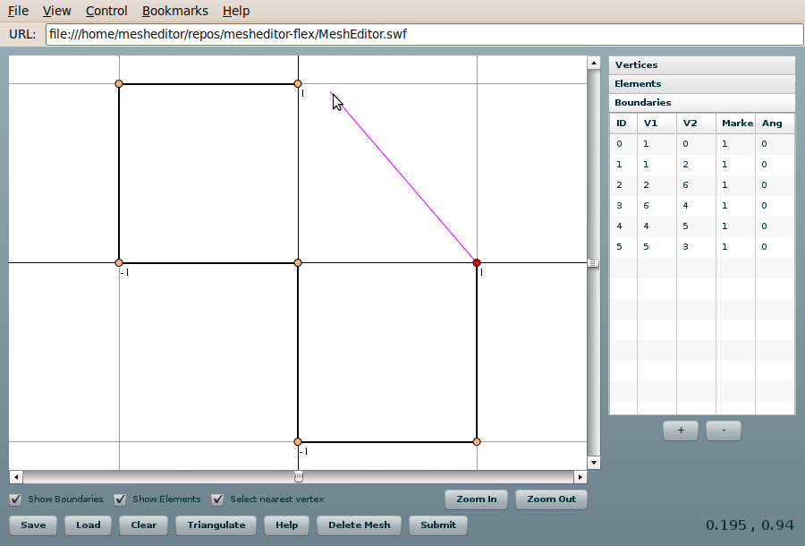
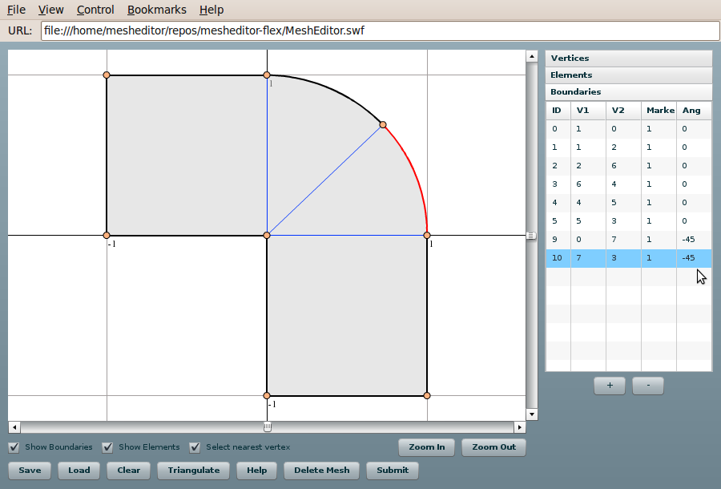

======================================
Using Mesh Editor in FEMhub Online Lab
======================================
To use the Mesh Editor in your local FEMhub you will need to install the latest
spkg package of mesheditor in FEMhub as described below. If you do not have
FEMhub built in your machine you can use the `FEMhub Online Lab running in our
server <http://lab.femhub.org/>`_. If so, just skip the next instruction titled
"Install Mesh Editor in FEMhub".

Install Mesh Editor in FEMhub
-----------------------------
First, you need to have FEMhub built in your machine. The Mesh Editor is
installed by default when you build FEMhub. If you want to update FEMhub with the latest package
of Mesh Editor go to the the top directory of FEMhub and type the following to
install the Mesh Editor package::
    \$ ./femhub -i -f http://femhub.org/stpack/mesheditorflex-201012070446_d6f12f0.spkg

You can find the latest versions of Mesh Editor in `this page
<http://femhub.org/codes.php>`_. Just replace the link in the above command by
the link to latest package.

Running Mesh Editor
-------------------
To run the mesh editor in the FEMhub Online Lab type the following command to
open the Online Lab::
    \$ ./femhub
   ----------------------------------------------------------------------
   | FEMhub Version 0.9.10.beta1, Release Date: November 21, 2010       |
   | Type lab() for the GUI.                                            |
   ----------------------------------------------------------------------
   In [1]: lab()

Then point your browser to http://localhost:8000. Then you will see the user
interface of the Online Lab where you will be able to use the Mesh Editor.

Using Mesh Editor
-----------------
After you open the Mesh Editor window in the Online Lab, you can try creating
different types of two dimensional meshes including curvilinear elements. You
can click **"Help"** button to open the help window which lists the keyboard shortcuts.

Creating New Vertices
~~~~~~~~~~~~~~~~~~~~~
Press Ctrl+click to create new vertices. You can edit the exact coordinates of the vertices on the X and Y column at the right.
You can do doubleclick to remove the vertices.

Creating New Boundaries
~~~~~~~~~~~~~~~~~~~~~~~
Click the **"Boundaries"** tab on the right, and click on the vertices to draw boundaries as shown in the following image.
You can edit the boundary Marker on the Marker column at right. You can also delete the boundaries by doubleclicking.

Creating New Elements
~~~~~~~~~~~~~~~~~~~~~
Click the **"Elements"** tab, and click on each vertices to create elements as shown in the following image.
You can delete the elements by double-clicking.

You can add curvilinear boundaries by changing the angle of boundary in the "Ang" column on the right.
the angle of the in the umns

Triangulation
~~~~~~~~~~~~~
After creating vertices and boundaries, you can press **"Triangulate"** button to use triantulation feature.

Saving and Loading Mesh Files
~~~~~~~~~~~~~~~~~~~~~~~~~~~~~
You can click **"Load"** button to load a mesh file. And, you can click
**"Save"** button to save the mesh created by the Mesh Editor.

Zooming In and Out
~~~~~~~~~~~~~~~~~~
Press the buttons **"Zoom In"** and **"Zoom Out"** for this. You use the middle
wheel of the mouse to zoom in and out. Alternatively, press **"Ctrl and -"**
and **"Ctrl and ="** keys in your keyboard to use the zoom feature.
