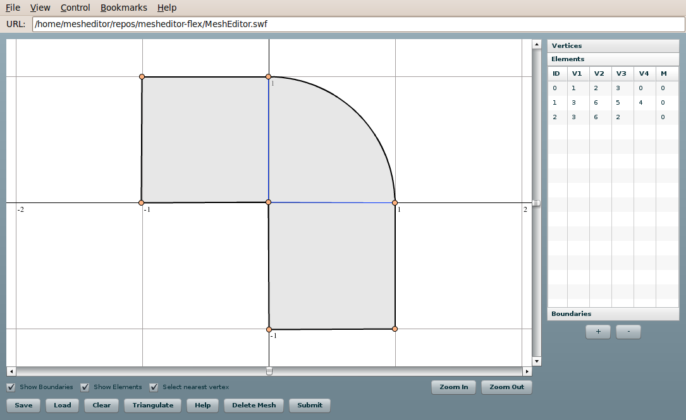

============
Introduction
============

This is a documentation for Finite Element Mesh Editor for `FEMhub <http://femhub.org>`_.
which is written in ActionScript.

It can be run within the FEMhub Online Lab, and needs flashplayer plugin
installed in the browser. It can handle curvilinear elements, and is able to
triangulate if used within FEMhub Online Lab.

You can read the instructions for building and running it in `this page
<install_run.html>`_.

License
=======
It is available under the BSD license. The source code can be viewed in the
`git repository <http://github.com/hpfem/mesheditor-flex>`_.

Credit
======
It was developed by the `hp-FEM group <http://hpfem.org>`_ at University of Nevada, Reno. Following are
the people who contributed to the Mesh Editor by sending at least one patch (in
the order of their first contribution):
::
  Aayush Poudel
  Ondrej Certik
  Pavel Solin
  Sameer Regmi

Below is the screenshot of the Mesh Editor.

